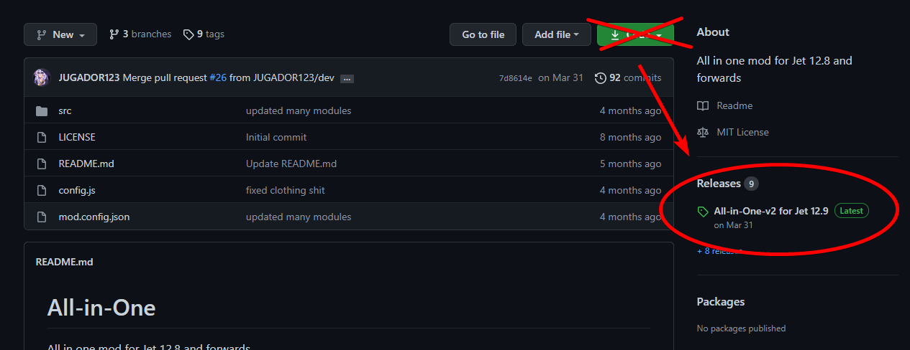
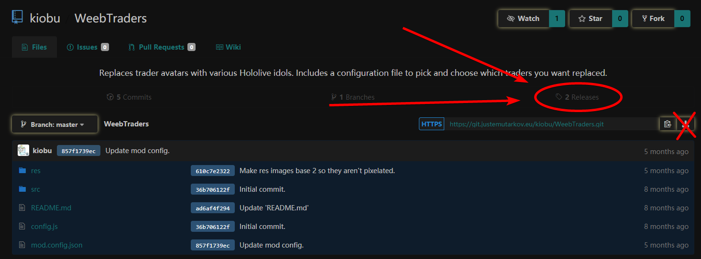
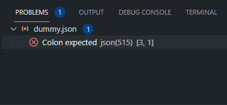

# FAQ 

## 1. What is JustEmuTarkov?
View [this page](../#what-is-justemutarkov).

## 2. Will this get me banned from Tarkov?
As long as you've installed this separately from your live EFT installation and don't have any EFT-related processes running alongside JET, until reported otherwise, this program will not cause any complications with your official Tarkov installation or account.

## 3. How do I install this?
View the [installation guide](/installation.md).

## 4. I already have an old version installed, do I really have to install it all over again?
The binaries and server files are a small package, usually never exceeding 50 MBs. Sometimes, depending on how big the differences between versions are, a client patch will be manually compiled to at least try to cut down on data usage; however, the legality of this is yet to be proven, and are as such only provided as a service and can be withdrawn at any time.

tl;dr, yes.

## 5. I already have Tarkov installed, can I use these files instead?
If the version of your live Tarkov installation is a supported JET version, then yes. Simply copy all the client files to a separate folder, and extract the JET binaries over them. However, this is rare, as EFT releases small patches intermittently. Make sure you backup your live client if it is a supported JET client, to prevent it from being automatically updated to an unsupported version.

## 6. I can’t find any copies of EFT, or, I can’t download them because of bandwidth limitations.
Although we may offer simpler compacted and stripped down versions to get the base program running, it is still advised that you purchase a copy of Escape from Tarkov from BSG and download the required files through their launcher instead. This project was originated from a cheating forum and was meant to make it easier to develop cheats for official game; however, it has now branched to allow players enjoy a single player experience. This project never was meant to be a piracy project and never will be. We are assuming that everyone who uses this project to play the game already have the game purchased. We dont have any way to detect if you have already purchased game or not, so we are unable check it in any respectable way to make sure that you have an official game bought.

## 7. How do I give myself more money levels ect?
Most of what you might want to modify has been well documented (with video examples) under the [character edits section.](../character/character_edits/)

## 8. I changed some of the (gameplay) settings in the server files, but I don’t see the changes in game!
You might be required to clear your cache and restart the server to recache the database. Additionally, remember to only edit files when the server is turned off, otherwise, changes will likely not be retained.

## 9. How do I install mods?
You can usually install mods by extracting them into your `[server]/user/mods` folder. After extracting your corresponding mod into its folder, usually said folder should contain some form of README, or a configuration file. Check these out for extra information on how to use the mod you've downloaded.

You should be aware that mods not made for the version of JET you are using will most likely not function properly, if at all.

## 10. I installed a mod and now my server stopped working!
You likely installed a mod that is not compatible with your version of the server. 

If you get an error similar to `no such file or directory '.../mod.config.json'`, view the below FAQ (#11).

## 11. I get a missing mod.config.json error when using a mod!
The mod's folder name is malformed. A mod folder name must follow the convention of `AuthorName-ModName-X.X.X`, where `X.X.X` is the mod version. These values correspond to the ones you find in the mod's `mod.config.json` file. 

You may also have downloaded an SPT-AKI mod, which is not compatible with JET. SPT-AKI mods are found on mods.sp-tarkov.com. Mods from this website will not work with JET unless ported by a developer.

If you downloaded your mod from GitHub or another Git website, odds are you downloaded the mod's source code instead of it's release package. Double check  and see if the source mod you downloaded has a release on Git. If the mod does not have a release package, assume that you should download the source instead.





This will not occur in future versions of JET (1.2.0 and newer).
## 12. Where do I change trader-related data?
If you are looking to modify player data concerning traders (standings, level, etc.), you will find it in your `[server]/user/profiles/[AID]/character.json` file, under the `TraderStandings` section. If you are looking to edit the database for traders (assort, barter scheme, etc.), it will be in the `[server]/db/traders` directory. Note that any changes to the database require a recache.

## 13. Where can I change my character’s data?
You can find most character stats and related in your profile, found under `[server]/user/profiles/[AID]/character.json`

See the [character edits section.](../character/character_edits/)

## 14. How do I give myself more money?
See the [character edits section.](../character/character_edits/)

## 15. How do I increase the rate at which I gain XP?
You will need to edit the database's `globals.json` file for it. Depending on the version of JET, this may be in `[server]/db/cacheBase` or `[server]db/base`. 

Inside the globals, find:

`"skillProgressRate": 1`  

and:  

`"WeaponSkillProgressRate": 0.4`  

Change these to any rate you’d like. The default values are live values.  

Additionally, Tarkov has a skill fatigue system, which means that it will decrease the rate at which you gain skill points the more you play.  

To disable this, find a line in the globals called ‘SkillFatiguePerPoint’. By default, the area looks like this:  

```
"SkillMinEffectiveness": 0.1,
"SkillFatiguePerPoint": 0.0006,
"SkillFreshEffectiveness": 1.3,
"SkillFreshPoints": 1,
"SkillPointsBeforeFatigue": 1000,
"SkillFatigueReset": 200,
```

Experiment with these values as you wish, lowering `SkillFatiguePerPoint`, increasing `SkillMinEffectiveness` and `SkillPointsBeforeFatigue` will all contribute to preventing fatigue from setting in, as well as increasing the amount of skill points you receive.

## 16. How do I skip a quest?
A video tutorial can be found in the [character edits section.](../character/character_edits/)

In your `[server]/user/profiles/[AID]/character.json`, you will find several mentions of `“qid”`. This stands for quest ID. 

Example:
```js
{
	"qid": "5eaaaa7c93afa0558f3b5a1c",
	"startTime": 0,
	"completedConditions": [],
	"statusTimers": {},
	"status": "Locked"
},
```
You can change the `"status"` of these to:

- **“Locked”**
	- _Unavailable to start until requirements are met._

- **“AvailableForStart”**
	- _The quest is ready to be started. This can be handy to restart a quest, for example, when you lose a quest related item in a raid._

- **“Started”**
	- _The quest has been started and is waiting for all requirements to finish._

- **“AvailableForFinish”**
	- _The quest can be delivered. Setting it to this allows you to collect the rewards._

- **“Success”**
	- _The quest has been successfully completed, and rewards have been collected._

Quest ID's can be found in the [quests directory.](../resources/quests/)

## 17. How do I skip hideout progression?
In your `character.json`, you will find a section identified with `“Hideout”`. In this section, search for the `"areas"` object.

Each hideout item will look similar to this:
```js
{
	"type": 3,
	"level": 4,
	"active": true,
	"passiveBonusesEnabled": true,
	"completeTime": 0,
	"constructing": false,
	"slots": [],
	"lastRecipe": ""
},
```

You can increase or decrease the `"level"` parameter according to the [hideout areas directory.](../resources/hideout_areas/)  

## 18. When I start the server, it crashes immediately!
First, try deleting your cache (`[server]/user/cache/`). If that is unsuccessful, then the server files are most likely corrupted. To reinstall the server while retaining progress, copy your `[server]/user/configs/accounts.json` and your `[server]/user/profiles` folder somewhere else. Reinstall the server and replace these saved files and folders.

## 19. I can’t extract when in a raid!
Double-tap "O" (or your other keybind) to view the extracts. If none exist, you have a bugged raid. ALT+F4 to leave raid without losing items.

## 20. My game is throwing the error: `An item with the same key has already been added.`
Join the [EmuTarkov](https://discord.gg/NJANk5gCeN) Discord and run `/key` in the `#bot` channel.

## 21. My traders don’t work, are empty, or are stuck infinitely handling a transaction!
Did you recently modify your character's money amount? If so, view the `[client]/Logs/[timestamp]/[timestamp]_traces.log` file.

Search the file for the following error:
```
Newtonsoft.Json.JsonReaderException: JSON integer ... is too large or small for an Int32.
```

If you see this error, you set the value of your money higher than what computers can store in a 32-bit signed integer (2.147 billion). Reduce the value to something more reasonable, like 900 million, and the error will resolve itself.

If you did not edit your money recently, or do not see the above error, try clearing your server's cache and restarting the server as demonstrated further above. If that doesn’t solve it, you may have an inconsistent item ID in your stash.

To confirm this, view the `[client]/Logs/[timestamp]/[timestamp]_traces.log` again. The log may contain something resembling the following:
```
EXCEPTION: System.ArgumentOutOfRangeException: Index and length must refer to a location within the string.
Parameter name: length
```

If you see this error, you have an item ID that is not 24 characters long. This prevents the game from parsing the item. To fix this, you will need to run [this patch](checkifover24.js) on your `character.json` file with Node.js. If you are unsure how to do this, join the [EmuTarkov Discord](https://discord.gg/NJANk5gCeN) and ask for assistance in the `#support` channel.

## 22. I have an `Unexpected token` syntax error!
Your error may look similar to the following:
```
SyntaxError: Unexpected token ! in JSON at position 1234.
```

This error occurs when you naïvely edit a `.json` file without validating the syntax. This means there is an illegal character somewhere that prevents the server from properly parsing and loading that file. To find it, you need to go back and check the files you edited with a JSON validation tool. [Visual Studio Code](https://code.visualstudio.com/) is a text editor with this function built in. To fix this error, you'll need to load whatever file(s) you edited and check them for syntax errors.

Here's an example of a syntax error in a JSON file viewed on VSCode:



You can click the error in VSCode's *Problems* tab to jump directly to the syntax error in question, or you can scroll to the line manually. Syntax errors will be denoted with a red spellcheck underline. Fix the syntax error and recache to resolve your issue.

A guide to JSON syntax can be found [here](https://www.w3schools.com/js/js_json_syntax.asp).

## 23. What's the difference between JET (JustEmuTarkov) and the SPT-AKI project?
Both projects accomplish the same task. They both emulate the EFT backend server to allow you to play a singleplayer-only version of Escape From Tarkov. Intricately, both emulators have significant differences in code, but they are mostly indistinguishable for the user, as both function the same way. However, this means SPT-AKI mods will not work on JET, and vice-versa. Additionally, AKI requires a legitimate EFT license, whereas currently, JET does no legitimacy checks on the client. Most people make their choice based upon their perception of the communities or mod availability.

The major difference that separates SPT-AKI from JET is that JET has a small development team that is working to make a multiplayer-compatible JET server that allows you host a dedicated match server to play co-op with your friends. However, the development on this is very slow, considering the amount of reverse engineering required. Please don't ask us about the ETA for this, as it's a very ambitious project, and we work on it on our own time.

JET support is offered on this Discord, the partnered ConfigFreaks Discord, and the official JET Discord, whereas SPT-AKI support is only available on the Guilded known as Senko's Pub. We do not offer any support to SPT-AKI users, since there are major differences in code we have no idea about, and because this is a JET community, not an SPT-AKI one.

In case you're asking which one to choose, there's virtually no difference when it comes to performance, moddability, user friendliness, and quality of emulation. If you want the latest updates with possible bugs, SPT-AKI releases new updates quite frequently, and runs on a rolling release platform, where the latest game version is supported at the cost of potential instability. In contrast, JET works on a point-release system, where we release new updates relatively slowly to ensure as much stability possible. This means AKI may be a major version of EFT ahead, while JET would be on an older version.

## 24. Where should I go if I want SPT-AKI support?
This is a JET Discord server. The official SPT-AKI developers are available on Guilded.gg on Senko's Pub. However, you can also receive AKI-related support on Discord at the EmuTarkov Related Community server [here](https://discord.gg/BpKdMkv).

Please note that EmuRC is not the official SPT-AKI community. They are an affiliate community, and as such have inherently different communities, structure, rules, staff teams, etc. Please be aware of this when intermingling between these communities.

## 25. I have an issue/question about Altered Escape.
Because Altered Escape is a third-party mod for JET, and uses an experimental, in-development server build, we do not offer Altered Escape-specific support. You are best off looking for AE support [here](https://discord.gg/tagQAqw3HB).
